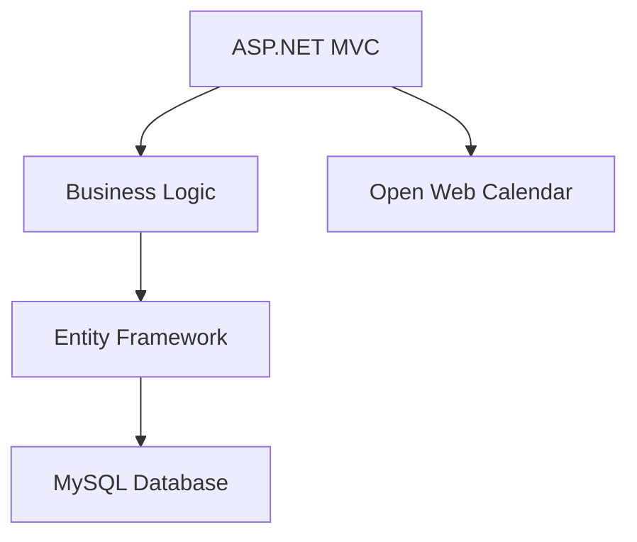

# MAS - Modelowanie i Analiza Systemów Informacyjnych

  
**Repository for the MAS course at PJATK**

---

## 📌 Course Overview
Implementation of conceptual models in object-oriented and relational environments, covering:
- Business logic implementation
- Advanced GUI development
- UML diagram realization
- Database integration

**Key Technologies**:  
`C#` `ASP.NET Core` `MySQL` `UML` `Entity Framework`

---

## 🧩 Mini-Projects Structure

| Project           | Concepts Implemented             | Business Case               | Tech Stack             |
| ----------------- | -------------------------------- | --------------------------- | ---------------------- |
| **[MP01](MP01/)** | Classes, Attributes, Persistence | Student Management System   | C#, JSON Serialization |
| **[MP02](MP02/)** | Associations, Composition        | Package Delivery System     | C#, OOP Principles     |
| **[MP03](MP03/)** | Inheritance, Polymorphism        | University Personnel System | C#, Interfaces         |
| **[MP04](MP04/)** | Constraints, Validation          | Group Management System     | C#, Logger Patter      |

---

## 🏆 Final Project: University Calendar System
**`Projekt` directory contains complete documentation**

### Key Features:
- Role-based access (Student/Teacher/Director)
- Class scheduling with constraints
- Group management
- Persistent data storage

### Documentation Includes:
1. Requirements specification
2. UML diagrams:
   - Use Case
   - Class (Analytical & Design)
   - Activity & State
3. GUI prototypes
4. Design decisions rationale

### Technical Implementation:

## 🛠️ Development Environment

**Recommended Tools:**

- IDE: JetBrains Rider
- Database: MySQL 8.0+
- UML: LucidChart
- Version Control: Git

------

## 📚 Course Materials

1. Recommended Book:
   *"Modelowanie i implementacja systemów informatycznych"* by M. Trzaska# Modelowanie_i_Analiza_System_informacyjnych-MAS
